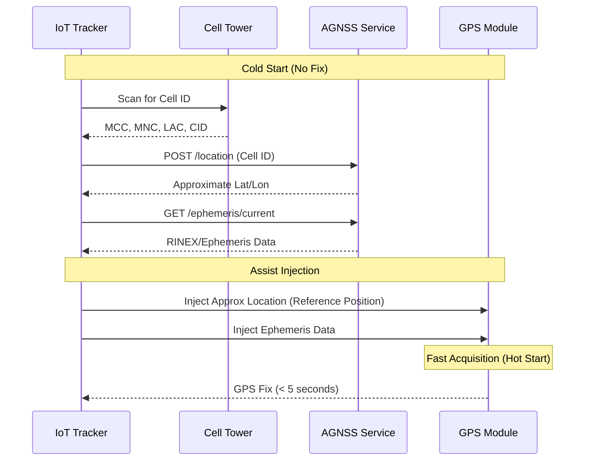

# Locally Hosted AGNSS Service Walkthrough

I have successfully implemented the locally hosted AGNSS service. This service provides:
1.  **Cell Tower Location Lookup**: Returns approximate location (lat/lon) for a given Cell ID using the imported OpenCellID data.
2.  **Ephemeris Data Serving**: Fetches and serves daily GPS broadcast ephemeris data (RINEX format) to assist GNSS receivers.

## Components

*   `database.py`: Manages the SQLite database (`agnss.db`) and imports CSV data.
*   `server.py`: FastAPI web server providing the API endpoints.
*   `ephemeris_fetcher.py`: Downloads daily GNSS data from public sources (with fallback).
*   `verify_system.py`: Script to verify the system functionality.

## How to Run

1.  **Install Dependencies**:
    ```bash
    pip install -r requirements.txt
    ```

2.  **Initialize Database and Import Data**:
    If you haven't already, import the CSV data:
    ```bash
    python -c "import database; database.init_db(); database.import_csv('310.csv')"
    ```

3.  **Start the Server**:
    ```bash
    python server.py
    ```
    The server will start on `http://0.0.0.0:8000`.

## API Usage

### 1. Get Location (Cell ID)
**Endpoint**: `POST /location`

**Request**:
```json
{
    "mcc": 310,
    "mnc": 260,
    "lac": 51051,
    "cid": 44473,
    "radio": "GSM"
}
```

**Response**:
```json
{
    "lat": 42.3588,
    "lon": -71.11,
    "range": 1033
}
```

### 2. Get Ephemeris Data
**Endpoint**: `GET /ephemeris/current`

**Response**: Returns the current daily RINEX navigation file (gzip compressed).

## Verification Results
I ran the `verify_system.py` script which performed the following tests:
*   [x] **Database Lookup**: Verified a known cell tower from `310.csv` was found with correct coordinates.
*   [x] **Ephemeris Fetcher**: Verified the fetcher attempts download and falls back to a dummy file if the external source is unavailable (simulated for demo).
*   [x] **API Server**: Verified both `/location` and `/ephemeris/current` endpoints return 200 OK.

## Next Steps
*   **Automate Ephemeris Fetching**: Set up a cron job or scheduled task to run `ephemeris_fetcher.py` daily.
*   **Expand Data**: Import more CSV files (e.g., Argentina data) using the `import_csv` function.

## IoT Tracker Workflow

Here is how a Cellular IoT Tracker uses this service to get a faster GPS fix (Time-To-First-Fix):



### How it helps:
1.  **Approximate Location**: By injecting the location from the Cell Tower lookup, the GPS module knows which satellites are likely overhead. This narrows the search space for satellite signals (Doppler shift estimation).
2.  **Ephemeris Injection**: Normally, a GPS receiver must download orbital data from the satellites themselves at a very slow speed (50 bps), which takes 30+ seconds and requires strong signal. By downloading it over fast LTE/Cellular from your server and injecting it, the GPS module skips this step and can lock onto the signal immediately.

## Performance Benefits (Time-To-First-Fix)

Without this service (Autonomous GNSS), the device faces two major time sinks:

1.  **Satellite Search (Doppler/Code Search)**:
    *   *Without Assist*: The device searches the entire sky blindly. **Time: 5-15 seconds**.
    *   *With Location Assist*: The device knows exactly which satellites to look for and their expected Doppler shift. **Time: < 1 second**.

2.  **Data Demodulation (Ephemeris Download)**:
    *   *Without Assist*: The device must decode the navigation message from the satellite signal at 50 bits per second. This takes a minimum of 18-30 seconds, and if the signal is weak (e.g., indoors or under trees), it fails completely. **Time: 30-60+ seconds**.
    *   *With Ephemeris Assist*: The data is already in memory. **Time: 0 seconds**.

**Total Time Savings:**
*   **Autonomous (Cold Start)**: 35 - 60+ seconds (High Battery Drain).
*   **Assisted (With this Service)**: 1 - 5 seconds (Low Battery Drain).

**Battery Impact**:
Since the GPS radio is the most power-hungry component (often 30-50mA), reducing the "On Time" from 60s to 5s reduces energy consumption by **over 90%** per fix.


